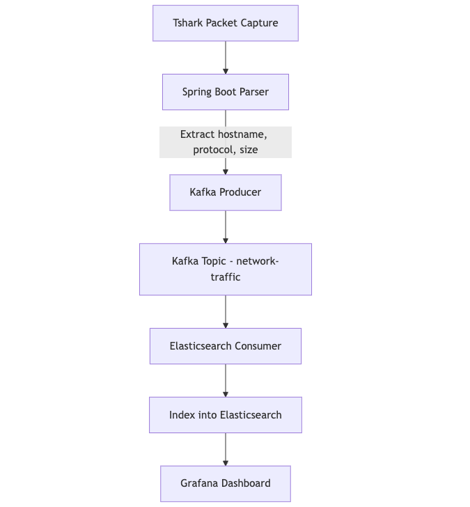

# Local Web Traffic Classifier & Analytics Pipeline

> **Engineered a local machine web traffic classification and analytics pipeline using Wireshark, Spring Boot, Kafka, ElasticSearch, and Grafana to inspect TCP/UDP/QUIC packets; extracted protocol, packet size, and hostname (SNI/DNS) metadata to classify traffic to domains like Amazon, YouTube, and Netflix.**

---

## 🚀 Overview
This project analyzes **local machine web traffic** in real time and classifies it by **hostnames, protocols, and data size** using a pipeline of powerful tools:

- **Wireshark (Tshark)** to capture packets
- **Spring Boot** to process and publish data
- **Apache Kafka** to stream packets
- **Elasticsearch** to index metadata
- **Grafana** to visualize traffic trends

The core objective was to build a system capable of answering:
- _"How many packets are sent to YouTube?"_
- _"How much traffic was inbound vs outbound for Amazon?"_
- _"Which protocols are used most frequently?"_

---

## 🧠 Problem & Objective
Modern browsers encrypt traffic, making deep inspection hard. Existing tools often lack localized and extensible solutions for personal use or internal corporate networks. We wanted:
- A **local** system to classify **outgoing/incoming** traffic per device
- **Metadata extraction** for TCP/UDP/QUIC protocols
- **Hostname resolution** using **TLS SNI** and **DNS queries**
- **Searchable storage** and **visual analytics**

---

## 🏗️ Architecture



---

## 🧩 Key Challenges & How We Solved Them

### 📦 1. **Tshark Output Fragmentation**
- **Problem**: Tshark emits packets as JSON arrays, not one per line.
- **Action**: Buffered incoming data until it formed a valid JSON array using Jackson `readTree()`.
- **Result**: Prevented malformed JSON errors and ensured stable packet parsing.

### 🔐 2. **Encrypted Traffic (HTTPS/QUIC)**
- **Problem**: Cannot decrypt payloads, so identifying hostnames was difficult.
- **Action**: Parsed **TLS SNI** fields and **DNS queries**.
- **Result**: Resolved hostnames like `youtube.com` even over encrypted traffic.

### 📶 3. **Identifying Protocols and Traffic Direction**
- **Problem**: Differentiating inbound vs outbound, and extracting the protocol.
- **Action**: Used `ip.src`, `ip.dst`, and `frame.protocols` to extract packet metadata.
- **Result**: Correct classification of traffic by direction (INBOUND/OUTBOUND) and protocol.

### 📊 4. **Search and Visualization**
- **Problem**: Raw data was unusable for insights.
- **Action**: Indexed into **Elasticsearch** and visualized with **Grafana**.
- **Result**: Clean dashboards showing real-time traffic trends per domain/protocol.

---

## 🔧 Setup Instructions

### 1. Requirements
- Java 21
- Spring Boot 3.4.3
- Apache Kafka & Zookeeper
- Elasticsearch (v8+)
- Grafana (v10+)
- Tshark (part of Wireshark)

### 2. Clone & Build
```bash
git clone https://github.com/yourusername/local-traffic-analyzer.git
cd local-traffic-analyzer
mvn clean install
```

### 3. Start Kafka & Zookeeper
```bash
# Start Zookeeper
bin/zookeeper-server-start.sh config/zookeeper.properties

# Start Kafka
bin/kafka-server-start.sh config/server.properties
```

### 4. Start Elasticsearch & Grafana (Docker)
```bash
docker run -d -p 9200:9200 -e "discovery.type=single-node" elasticsearch:8.11.1
docker run -d -p 3000:3000 grafana/grafana
```

### 5. Run the Spring Boot App
```bash
# App auto-starts packet capture on launch
./mvnw spring-boot:run
```

---

## 📈 Sample Output (Kafka Message)
```json
{
  "websiteName": "youtube.com",
  "packetSize": 1342,
  "sourceIp": "192.168.1.8",
  "destinationIp": "142.250.72.238",
  "protocol": "tls,tcp,ip,eth",
  "timestamp": 1711429812000,
  "direction": "OUTBOUND"
}
```

---

## 📊 Grafana Visuals
- 🔵 Packet counts per hostname (YouTube, Netflix, etc.)
- 🟢 Traffic volume by protocol (TCP, UDP, QUIC)
- 🔴 Inbound vs Outbound volume over time

---

## 📌 Future Enhancements
- QUIC-specific packet parsing for better YouTube/Netflix visibility
- Auto-detection of active WiFi interface (e.g., en0 vs wlan0)
- User session grouping and behavioral analysis

---

## 🤝 Contributions
Pull requests welcome! Let’s make local network analysis easier for all
